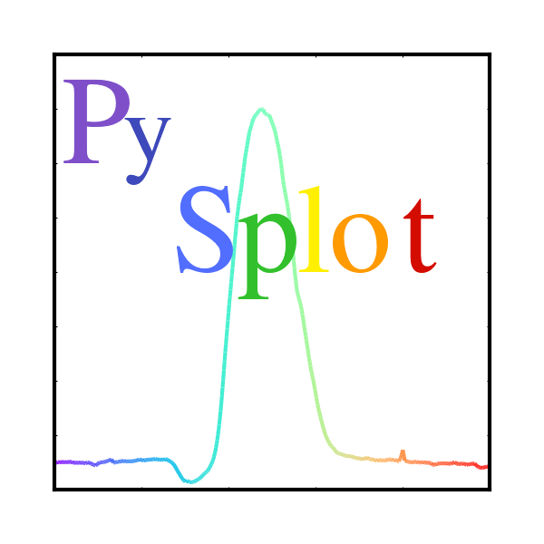

 <a href="https://thomasjoshd.github.io/">Home</a>
# pysplot
An IRAF-like tool for manipulating, and measuring 1-D FITS spectra.

PySplot is an interactive GUI program to plot and measure 1-D spectra in fits or text form. At this time fits tables are not supported well. The GUI makes use of several python libraries.

There are compiled versions linked below, but I have run into problems with pyinstaller and have returned to just offering the pysplot code.  The code can be run from python3 by running the PySplot.py.

This program is very much still under development, feature requests are welcome, but understand I teach full time. This is my passion project and I hope for everyone to find it useful.

# Download

For the current development versions please use <a href="https://github.com/thomasjoshd/pysplot">github</a>.

For some stand-alone versions you can check out the dropbox link that I will leave archived for a while.
Now hosting complied version via <a href="https://www.dropbox.com/sh/typny1czo7jrh8o/AACNHse9cJYSQ0-y5FOI963oa?dl=0">dropbox</a>.

# Tutorials

More on the way!

<a href="https://youtu.be/KVL70Wp-aKg">Bisect a feature</a>

<a href="PySplot_Normalization_Tutorial.pdf">Normalization</a>
